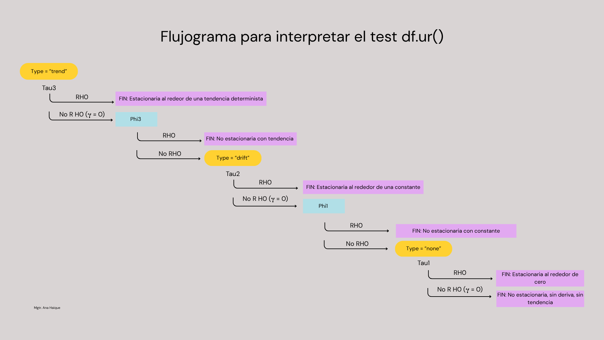

```{r}
#| label: setup

library(tidyverse)
library(lubridate)
library(timetk)
library(modeltime)
library(tidymodels)
library(urca)    # ur.df()
```

# Objetivo de esta clase

En la clase anterior aprendimos a **mirar** una serie, **diagnosticarla** y **transformarla** cuando hacía falta estabilizar varianza o linealizarla. Antes de pasar a los modelos, vamos a dar un paso más específico: vamos a estudiar un tipo particular de proceso — el **camino aleatorio** (*random walk*) — que aparece todo el tiempo en series financieras y económicas, y que tiene una propiedad curiosa: **es, al mismo tiempo, uno de los procesos más simples de entender y uno de los más difíciles de pronosticar**.

# Proceso estocástico vs. realización

Antes de definir el camino aleatorio, necesitamos un concepto que vamos a usar todo el curso, casi siempre de forma implícita: la diferencia entre **proceso estocástico** y **realización**.

::: {.callout-note title="Definiciones"}
- Un **proceso estocástico** es la *receta generadora*: una familia de variables aleatorias indexadas en el tiempo, junto con las relaciones probabilísticas entre ellas (por ejemplo, la ecuación $y_t = y_{t-1} + \epsilon_t$). Es la "población" en datos transversales.
- Una **realización** (o *trayectoria muestral*, *sample path*) es **una** secuencia concreta de valores que ese proceso produjo — o podría haber producido. Es lo que efectivamente observamos: la serie de precios de una acción, el PBI trimestral, etc.
:::

Cuando trabajamos con datos reales, **solo tenemos una realización**. Nunca vamos a poder "correr de nuevo la historia" y ver qué otra trayectoria hubiera generado el mismo proceso. Esto es fundamental: toda la inferencia estadística que hacemos sobre una serie de tiempo (medias, varianzas, tests de estacionariedad) se apoya en el supuesto de que esa única realización nos permite aprender algo sobre las propiedades del proceso que la generó.

Por ejemplo si definimos el proceso estocástico (una caminata aleatoria):

$$Y_t = Y_{t-1}+\varepsilon_t$$

$t = 1, 2 ... n$

Si cambiamos $\varepsilon_t$ 1000 veces, tendríamos 1000 realizaciones del mismo proceso.

# El proceso de camino aleatorio

Un **camino aleatorio** (*random walk*) es un proceso en el que el valor presente depende del valor anterior más un número aleatorio: hay la misma probabilidad de subir que de bajar, en una magnitud que no podemos anticipar.


## Simulación de un camino aleatorio sin deriva

Para simplificar, empecemos con $y_0 = 0$. Bajo estos supuestos, el valor en cualquier instante $t$ es simplemente la **suma acumulada** de los errores hasta ese momento:

$$
y_t = \sum_{i=1}^{t} \epsilon_i
$$

```{r}
#| label: simular-rw

set.seed(123)
n <- 200
# Con Yo = 0
Yt <- rnorm(n, mean = 0, sd = 1) |>  
  cumsum()  #varepsilon acum

tiempo <- seq(1, by = 1, length.out = n)

Yt_RW <- tibble(tiempo = tiempo, Yt = Yt)
```

```{r}
#| label: viz-rw

Yt_RW |>
  plot_time_series(
    .date_var    = tiempo,
    .value       = Yt,
    .title       = "Random Walk",
    .x_lab       = "Tiempo",
    .y_lab       = "Yt",
    .smooth      = FALSE
  )
```

Fijate las características típicas: tramos largos con tendencia positiva o negativa, y cambios abruptos de dirección. Esto **no es una tendencia o ciclo real**: es simplemente la acumulación de ruido aleatorio. Es una trampa visual muy común, y va a ser importante tenerla presente.

## Camino aleatorio con deriva

$$
y_t = C + y_{t-1} + \epsilon_t
$$

Donde $C \neq 0$, decimos que es un **camino aleatorio con deriva** (*random walk with drift*). Cada paso todavía tiene la misma cuota de aleatoriedad, pero además hay un "empuje" constante en una dirección.


```{r}
#| label: simular-rw-deriva

set.seed(123)
#Yo = 0
 
deriva <- 2  #(pendiente)
Yt_RWCD <- deriva*tiempo+Yt #Sum u_t


Yt_RWCD <- tibble(tiempo = tiempo, Yt_RWCD  = Yt_RWCD) 
```


```{r}
#| label: viz-rwcd

Yt_RWCD |>
  plot_time_series(
    .date_var    = tiempo,
    .value       = Yt_RWCD,
    .title       = "Random Walk with Drift",
    .x_lab       = "Tiempo",
    .y_lab       = "Yt",
    .smooth      = FALSE
  )
```


::: callout-tip
## Qué mirar en el gráfico

Con deriva, el proceso conserva la misma volatilidad paso a paso, pero además tiene una tendencia de fondo sistemática: en promedio, cada paso empuja $C$ unidades hacia arriba. Muchas series financieras con tendencia de largo plazo (por ejemplo, un índice bursátil que sube en promedio con el tiempo) se comportan como un camino aleatorio **con** deriva. La dirección de la deriva depende del signo de $C$.
:::

# Discriminando un camino aleatorio

Ya sabemos simular un camino aleatorio porque lo construimos nosotros. Pero, ¿cómo hacemos para reconocer uno en datos reales, donde no conocemos la regla generadora?

> En el contexto de series de tiempo, decimos que una serie es un camino aleatorio si **su primera diferencia es estacionaria y no está autocorrelacionada**. Esa definición combina tres ideas que vamos a desarrollar por separado: **primeras diferencias**, **autocorrelación** y **estacionariedad**. 

## Diferenciación

La **diferenciación** (*differencing*) es una transformación matemática que consiste en reemplazar cada observación por la diferencia entre su valor y el de uno o más períodos anteriores. Su principal objetivo es eliminar cambios sistemáticos en el nivel de la serie, como tendencias o estacionalidades, para obtener una serie aproximadamente estacionaria.

La diferencia de orden 1 se define como:

$$
\Delta Y_t = Y_t - Y_{t-1}
$$


Si la serie aún no es estacionaria luego de una primera diferenciación, puede aplicarse una segunda diferencia:

$$
\Delta ^2 Y_t = \Delta Y_t - \Delta Y_{t-1}
$$

que equivale a:

$$
\Delta^2 Y_t = Y_t - 2Y_{t-1} + Y_{t-2}
$$

En series con estacionalidad también puede aplicarse una **diferenciación estacional**, restando el valor observado un período estacional atrás:

$$
\Delta_m Y_t = Y_t - Y_{t-m}
$$

donde \(m\) representa la longitud del ciclo estacional (por ejemplo, \(m=12\) para series mensuales o \(m=4\) para series trimestrales).

::: {.callout-note title="Ventajas"}

- Elimina tendencias determinísticas o estocásticas.
- Reduce la no estacionariedad de la media.
- Facilita la identificación y estimación de modelos ARIMA.
- Es una transformación sencilla.
:::

::: {.callout-note title="Desventajas"}
- Reduce la longitud de la serie, ya que se pierden observaciones iniciales.
- Una diferenciación excesiva puede introducir dependencia negativa entre observaciones.
- Si la serie ya era estacionaria, diferenciarla innecesariamente, la convierte en NO estacionaria.
::: 

### Diferenciación con `timetk`

La librería **timetk** implementa la función `tk_augment_differences()`, que permite generar una o varias series diferenciadas sin modificar la serie original. Por ejemplo, diferenciemos nuestro RW:

```{r}
#| label: Diferencias del RW

Yt_RW |> tk_augment_differences(
  .value = Yt,
  .lags = 1
)
```


::: callout-tip
- `.lags`: rezago utilizado para calcular la diferencia.

Por ejemplo:

- `.lags = 1` calcula la primera diferencia.
- `.lags = 2` calcula la diferencia respecto de dos períodos atrás (no las segundas diferencias).
- `.lags = 12` obtiene la diferencia estacional para una serie mensual.
- `.lags = c(1, 2, 3)` genera simultáneamente tres series: primera diferencia, segunda diferencia y tercera diferencia.

Es importante notar que **`.lags` no representa el orden de diferenciación**, sino el **rezago utilizado** en la transformación.
:::

## La función de autocorrelación (ACF)

::: {.callout-note title="Autocorrelación"}
En series de tiempo, la autocorrelación mide el grado de relación entre los valores de una serie y sus propios valores pasados. A diferencia de la correlación tradicional, que compara dos variables distintas, la autocorrelación compara una variable consigo misma desplazada en el tiempo.
Por ejemplo, si las ventas de este mes son similares a las del mes anterior, existe autocorrelación positiva en el rezago 1. Si cuando un valor es alto el siguiente tiende a ser bajo, existe autocorrelación negativa.
:::

Formalmente, la autocorrelación para un rezago $k$ se define como:

$$
\rho_k=\frac{\operatorname{Cov}(Y_t,Y_{t-k})}{\operatorname{Var}(Y_t)}
$$

donde:

- $Y_t$: valor de la serie en el instante $t$.
- $Y_{t-k}$: valor observado $k$ períodos antes.
- $\rho_k$: autocorrelación en el rezago $k$ .

Sus valores siempre están comprendidos entre **-1 y 1**:

- $\rho_k \approx 1$: fuerte asociación positiva.
- $\rho_k \approx -1$: fuerte asociación negativa.
- $\rho_k \approx 0$: ausencia de relación lineal.


Cuando hay tendencia, la ACF muestra coeficientes altos que decaen lentamente a medida que aumenta el rezago. Cuando hay estacionalidad, aparecen picos cíclicos. Graficar la ACF de un proceso **no estacionario** no aporta demasiada información nueva — por eso siempre la miramos **después** de asegurar estacionariedad.

### Cómo será la ACF de un proceso de ruido blanco?

Usaremos la `funcion plot_acf_diagnostics()` para visualizar el comportamiento de la ACF para una realización correspondiente a un proceso de ruido blanco.


```{r}
#| label: viz ruido blanco

set.seed(42)

ruido_blanco_tbl <- tibble(
  fecha = seq.Date(
    from = as_date("2015-01-01"),
    to   = as_date("2024-12-01"),
    by   = "month"             
  ),
  valor = rnorm(n = 120, mean = 0, sd = 1)
)

ruido_blanco_tbl |> plot_acf_diagnostics(
  .date_var              = fecha,
  .value                 = valor,
  .lags                  = 40,
  .show_white_noise_bars = TRUE
)

```

Si la serie corresponde a una **realización de un proceso de ruido blanco**, la autocorrelación poblacional es nula para todos los rezagos mayores que cero:

$$
\rho_k = 0, \qquad k>0.
$$


::: {.callout-note title="Autocorrelaciones muestrales"}
Sin embargo, en la práctica se observa una única realización del proceso y, por lo tanto, se calculan **autocorrelaciones muestrales** ($\hat{\rho}_k$). Debido a la variabilidad del muestreo, estos valores no son exactamente cero, sino que fluctúan aleatoriamente alrededor de cero (la mayoría de las autocorrelaciones dentro de las bandas de confianza aproximadas $\pm 1.96/\sqrt{n}$).
:::

De la función de autocorrelación parcial (PACF), nos ocuparemos más adelante.


## Estacionariedad

::: {.callout-note title="Definición"}
Un proceso es **estacionario** cuando sus propiedades estadísticas — media, varianza y autocorrelación — **no cambian a lo largo del tiempo**.
:::

Muchos modelos clásicos (familia ARIMA) **asumen estacionariedad**. Intuitivamente: si las propiedades del proceso cambian en el tiempo, los parámetros de cualquier modelo que ajustemos también deberían cambiar en el tiempo — y entonces no hay forma confiable de proyectar el futuro a partir del pasado.

::: {.callout-important title="Actividad"}
Intenta calcular la esperanza y la varianza para el proceso *random walk*
:::

Si nuestros modelos de pronóstico requieren de la estacionariedad, cuando una serie muestre un comportamiento no estacionario, deberá aplicarse alguna transformación en la serie de tiempo para hacerla estacionaria, como veremos más adelante.


## El test de Dickey-Fuller aumentado (ADF)

A diferencia del test de Dickey-Fuller original, el ADF incorpora (en la ecuación auxiliar) **rezagos de la serie diferenciada** para controlar la autocorrelación de los residuos. El modelo general que estima es:

$$
\Delta Y_t =
C +
\beta t +
\gamma Y_{t-1} +
\sum_{i=1}^{p}\delta_i\Delta Y_{t-i}
+\varepsilon_t 
$$

donde:

- $\Delta Y_t$: primera diferencia de la serie ($Y_t-Y_{t-1}$).
- $Y_{t-1}$: valor rezagado de la serie en niveles.
- $p$: número de rezagos incorporados.
- $\delta_i$: coeficiente de los rezagos de las diferencias.
- $C$: constante (drift).
- $\beta t$: tendencia lineal (si se incluye).
- $\gamma$: parámetro utilizado para contrastar la existencia de una raíz unitaria.

Si $\gamma=0$, la serie posee una raíz unitaria y no es estacionaria.


::: {.callout-note title="Test ADF"}
- **$H_0$:** existe una raíz unitaria en la serie (la serie **no** es estacionaria).
- **$H_1$:** no existe raíz unitaria (la serie **es** estacionaria).

El resultado es el **estadístico ADF** ( $\tau$ — cuanto más negativo, más fuerte el rechazo de $H_0$). Dickey y Fuller probaron que bajo Ho verdadera, el t estimado, sigue al estadístico tau, cuyos valores criticos se calcularon mediante simulaciones de Monte Carlo. (Gujarati & Porter, 2010, Cap 21.9)
:::

### ¿Qué modelo debo utilizar?

Una de las decisiones más importantes del test ADF es determinar qué componentes determinísticos deben incluirse en la regresión auxiliar. El paquete **urca** permite especificar tres alternativas mediante el argumento `type`.

#### `type = "none"`

Se estima

$$
\Delta y_t=
\gamma y_{t-1}+
\sum_{i=1}^{p}\delta_i\Delta y_{t-i}
+\varepsilon_t
$$

> No incorpora ni constante ni tendencia.

**Se utiliza únicamente cuando la serie $Y_t$ oscila alrededor de cero**, sin nivel medio distinto de cero y sin tendencia visible. Este caso es poco frecuente en aplicaciones reales.


#### `type = "drift"`

Se estima

$$
\Delta y_t=
C+
\gamma y_{t-1}+
\sum_{i=1}^{p}\delta_i\Delta y_{t-i}
+\varepsilon_t
$$

> Incluye una **constante**, pero no una tendencia lineal.

Es la especificación más utilizada cuando la serie ($Y_t$) presenta un nivel medio distinto de cero pero **no muestra una tendencia determinística**.

Ejemplos:

- temperatura media anual;
- producción industrial estabilizada;
- ventas que fluctúan alrededor de un promedio constante.

#### `type = "trend"`

Se estima

$$
\Delta y_t=
C+
\beta t+
\gamma y_{t-1}+
\sum_{i=1}^{p}\delta_i\Delta y_{t-i}
+\varepsilon_t
$$

> Incluye tanto una **constante** como una **tendencia lineal**.

Debe utilizarse cuando la serie presenta una tendencia aproximadamente lineal antes de realizar el test.

Ejemplos:

- población;
- PIB;
- series $Y_t$, cuyo gráfico muestra una clara tendencia ascendente o descendente.


::: {.callout-note title="En resumen"}
En la práctica, la mayoría de las series económicas y ambientales requieren utilizar **`drift`** o **`trend`**, mientras que la opción **`none`** se reserva para casos particulares.
:::


### Selección del número de rezagos

Además de definir el tipo de modelo, es necesario indicar la cantidad de rezagos (`lags`) que se incorporarán para eliminar la autocorrelación de los residuos $p$.

No existe una regla única para seleccionar este valor. Algunas estrategias habituales son:

- utilizar información previa sobre la serie;
- comparar distintos valores mediante criterios de información (AIC o BIC), es configurable en la función `ur.df()`.


---

### Implementación en R

```{r}
#| label: Dickey-Fuller

adf <- Yt_RW |> 
  pull(Yt)|> 
  ur.df(type = "drift", selectlags = "AIC")

summary(adf)
```


::: {.callout-note title="`type`"}
Porqué elegí `drift`? para forzar un error 🫠. En general:

- ¿La serie oscila alrededor de un nivel aproximadamente constante?
Sí → drift
- ¿La serie presenta una pendiente aproximadamente lineal durante casi toda la muestra?
Sí → trend
- ¿La serie oscila alrededor de cero?
Sí → none
:::


## Interpretación test ADF (`ur.df`)

El paquete **urca** reporta distintos estadísticos según la especificación elegida (`none`, `drift` o `trend`).

Los estadísticos **φ** son **tests auxiliares** que ayudan a validar la especificación del modelo, mientras que el estadístico **τ** responde la pregunta principal: **¿la serie tiene una raíz unitaria?**

| Estadístico | `type` | H0 | RH0 | No R H0 |
|:---------:|:---------:|----------|------------------|------------------|
| **τ₁** | `none` | $\gamma = 0$ | La serie es **estacionaria** alrededor de cero. &#128076; | No hay evidencia para rechazar que existe una raíz unitaria. Es **NO estacionaria** |
| **τ₂** | `drift` | $\gamma = 0$ | La serie es **estacionaria** (alrededor de una media constante). &#128076; | No hay evidencia para rechazar que existe una raíz unitaria. Es **NO estacionaria** |
| **φ₁** | `drift` | $C = 0$ y $\gamma = 0$| Existe evidencia de que el modelo requiere una constante (drift) o que la serie es estacionaria. El Random Walk sin deriva es incompatible con los datos. | Los datos son compatibles con un Random Walk sin deriva (conclusión débil - No R H0 nunca es probar que RW es cierto, solo que los datos no dan evidencia en contra). |
| **τ₃** | `trend` | $\gamma = 0$| La serie es **estacionaria** alrededor de una tendencia determinística. &#128076; | No hay evidencia para rechazar que existe una raíz unitaria. Es **NO estacionaria** |
| **φ₂** | `trend` | $C = 0$, $\beta = 0$ y $\gamma = 0$| Existe evidencia de que el modelo requiere una constante, una tendencia o que la serie es estacionaria. El Random Walk sin componentes determinísticos es incompatible con los datos. | Los datos son compatibles con un Random Walk sin constante ni tendencia determinística. |
| **φ₃** | `trend` | $\beta = 0$ y $\gamma = 0$ | Existe evidencia de que el modelo requiere una tendencia determinística o que la serie es estacionaria. | No hay evidencia suficiente para justificar la inclusión de una tendencia determinística. |


El daño de la sobreespecificación no es simétrico:

- Si existe raíz unitaria (no es estacionaria, con o sin deriva) → sobreespecificar (agregar constante o tendencia de más) casi no distorsiona la conclusión. El τ sigue sin rechazar, como corresponde. 

- Si no exite raíz unitaria (la serie ES estacionaria) → ahí sí sobreespecificar es peligroso: agregar constante/tendencia innecesarias le resta potencia al test, y puede hacer que τ no rechace aunque debería (error tipo II).

Como en la práctica no sabemos de antemano si estamos en el caso peligroso o no, se complementan las dos pruebas. Entonces, como procedemos?


::: {.callout-important title="Procedimiento recomendado"}
Paso 1: Pedimos los tres types arrancando por el más completo.

Paso 2: Sometemos los resultados al siguiente árbol de decisión:
::: 



```{r}
#| label: Dickey-Fuller-trend

adf <- Yt_RW |> 
  pull(Yt)|> 
  ur.df(type = "trend", selectlags = "AIC")

summary(adf)
```

```{r}
#| label: Dickey-Fuller-none

adf <- Yt_RW |> 
  pull(Yt)|> 
  ur.df(type = "none", selectlags = "AIC")

summary(adf)
```


::: {.callout-important title="Actividad sugerida"}
Aplica el test de D-F a nuestra caminata aleatoria con deriva.
::: 

## Ahora sí podemos discriminar un camino aleatorio

::: {.callout-note title="Recordar"}
En el contexto de series de tiempo, decimos que una serie es un camino aleatorio si su primera diferencia es estacionaria y no está autocorrelacionada. Esa definición combina las tres ideas que vimos por separado: primeras diferencias, autocorrelación y estacionariedad.
::: 

Hasta ahora vimos las herramientas por separado: cómo diferenciar, cómo leer la ACF y cómo aplicar el ADF. La pregunta de fondo de esta clase — *¿esta serie es un camino aleatorio?* — se responde combinándolas en un procedimiento único.

### El workflow

**Paso 1 · Visualizar la serie.** 

**Paso 2 · Test ADF en niveles** (procedimiento de los tres `type` que vimos, arrancando por `trend`).

Que la serie sea NO estacionaria es requisito necesario para un RW pero no suficiente.

**Paso 3 · Calcular la primera diferencia** 

$\Delta Y_t = Y_t - Y_{t-1}$.

**Paso 4 · Test ADF sobre $\Delta Y_t$.** 

Aquí sí esperamos rechazar H₀: la diferencia de un proceso no estacionario es candidata a ser estacionaria.

- Si **se rechaza** H₀ → la primera diferencia es estacionaria. Luego, pasamos al paso 5. 

**Paso 5 · ACF de $\Delta Y_t$.** 

Miramos la función de autocorrelación de la diferencia:

- Si los coeficientes están **dentro de las bandas de ruido blanco** ($\pm 1{,}96/\sqrt{n}$) → $\Delta Y_t$ no está autocorrelacionada → **Tenemos un RW**.

**Paso 6 · Formalizamos el paso 5.** &#127937; 

Test de Ljung–Box: 

$H0=ρ_1=⋯=ρ_m =0$ (ruido blanco, no hay autocorrelación)

vs.

$H1:∃k≤m:ρ_k\ne0$ (no es ruido blanco, hay alguna autocorrelación significativa)


::: {.callout-note title="Test de Ljung–Box (Q)"}

Es el test formal de referencia para decidir si una serie se comporta como **ruido blanco** — el complemento natural del Paso 5 del workflow.

**Hipótesis:**

$$H_0: \rho_1 = \rho_2 = \dots = \rho_m = 0 \quad \text{(no hay autocorrelación conjunta hasta el rezago } m\text{)}$$

**Estadístico:**

$$Q = n(n+2)\sum_{k=1}^{m}\frac{\hat\rho_k^2}{n-k} \;\sim\; \chi^2(m)$$

**En R:** `Box.test(x, lag = m, type = "Ljung-Box")` — viene en `stats`, no necesita paquete extra.

**Por qué este y no otro:**

- Es el test estándar de la metodología Box–Jenkins: está hecho exactamente para responder *"esta serie, ¿es ruido blanco?"*.

- Testea **varios** rezagos en simultáneo, no uno por uno como el visual.

**Cuántos rezagos `m` usar:**

La elección de `m` no es automática, adoptamos la regla propuesta en Hyndman & Athanasopoulos (2021), fpp3 Cap. 5:

- $m = \min(10,\, n/5)$ para series no estacionales y,

- Para series con estacionalidad de período $s$, el equivalente es $m = \min(2s,\, n/5)$.

Para YPF ($n \approx 375$): $m = \min(10,\, 75) = 10$.

*Nota: ¿Por qué usar un* `m` *relativamente pequeño?*

*Porque el test de Ljung–Box acumula la autocorrelación de los primeros rezagos. Si una serie no es ruido blanco, normalmente la dependencia aparece en los rezagos cercanos. Incorporar muchos rezagos adicionales agrega principalmente ruido al estadístico y reduce su capacidad para detectar autocorrelación real.*

:::

::: callout-tip
## Por qué estos tres pasos juntos, y no uno solo
- El ADF en niveles te dice si hay raíz unitaria (información sobre la serie original).
- El ADF en diferencias te dice si basta con una sola diferenciación (información sobre el *orden de integración*).
- La ACF en diferencias te dice si esa diferenciación "agotó" toda la estructura (información sobre la *dinámica residual*).

Si cualquiera de los tres falla, lo que tenemos **no** es un camino aleatorio puro: puede ser un RW con deriva, un RW con ruido, una serie $I(2)$, o un proceso estacionario mal diferenciado.
:::

# Aplicación: precio de cierre de YPF

Vamos a aplicar el workflow completo a la serie de precios de cierre de **YPF** en la bolsa de Nueva York. Trabajamos con el archivo `YPF.csv` (formato tipo Yahoo Finance: columnas `fecha`, `YPF.Open`, `YPF.High`, `YPF.Low`, `YPF.Close`, `YPF.Volume`, `YPF.Adjusted`). Para que el `.qmd` corra, el archivo debe estar en la misma carpeta que este documento.

### Carga y exploración

```{r}
#| label: ypf-carga

ypf <- read_csv("YPF.csv") |>
  select(fecha, cierre = YPF.Close) |>
  arrange(fecha)

ypf
```

```{r}
#| label: ypf-resumen

ypf |>
  summarise(
    n          = n(),
    desde      = min(fecha),
    hasta      = max(fecha),
    media      = mean(cierre),
    desvío     = sd(cierre),
    mínimo     = min(cierre),
    máximo     = max(cierre)
  )
```

### Paso 1 · Visualización

```{r}
#| label: ypf-viz

ypf |>
  plot_time_series(
    .date_var = fecha,
    .value    = cierre,
    .title    = "YPF — Precio de cierre diario",
    .x_lab    = "Fecha",
    .y_lab    = "Precio (ARS)",
    .smooth   = FALSE
  )
```

::: callout-tip
## Qué mirar
La serie claramente tiene tramos prolongados de suba y de baja sin anclar a una media. Eso es compatible con la sospecha de un camino aleatorio (o un camino aleatorio con deriva), pero todavía no alcanza como evidencia: necesitamos los tests.
:::

### Paso 2 · ADF en niveles (los tres `type`)

```{r}
#| label: ypf-adf-trend

ypf |>
  pull(cierre) |>
  ur.df(type = "trend", selectlags = "AIC") |>
  summary()
```

```{r}
#| label: ypf-adf-drift

ypf |>
  pull(cierre) |>
  ur.df(type = "drift", selectlags = "AIC") |>
  summary()
```

```{r}
#| label: ypf-adf-none

ypf |>
  pull(cierre) |>
  ur.df(type = "none", selectlags = "AIC") |>
  summary()
```

::: {.callout-note title="Conclusión"}
En YPF los tres τ **no rechazan** H₀. Conclusión del Paso 2: la serie **tiene raíz unitaria** (es no estacionaria) pasamos a diferenciar.
:::

### Paso 3 · Diferenciación


```{r}
#| label: ypf-diferencia

ypf_diff <- ypf |>
  tk_augment_differences(
  .value = cierre,
  .lags = 1
) |> 
  mutate(d_cierre = cierre_lag1_diff1) |>
  drop_na()


ypf_diff
```

```{r}
#| label: ypf-viz-diff

ypf_diff |>
  plot_time_series(
    .date_var = fecha,
    .value    = d_cierre,
    .title    = "YPF — Primera diferencia del precio de cierre",
    .x_lab    = "Fecha",
    .y_lab    = "Δ Precio (ARS)",
    .smooth   = FALSE
  )
```

A primera vista la serie diferenciada parece oscilar alrededor de un nivel (cercano a cero), sin una tendencia clara. Vamos a verificarlo formalmente.

### Paso 4 · ADF sobre la primera diferencia

```{r}
#| label: ypf-adf-diff-drift

ypf_diff |>
  pull(d_cierre) |>
  ur.df(type = "drift", selectlags = "AIC") |>
  summary()
```

```{r}
#| label: ypf-adf-diff-none

ypf_diff |>
  pull(d_cierre) |>
  ur.df(type = "none", selectlags = "AIC") |>
  summary()
```

::: {.callout-note title="Lectura"}
El estadístico τ sale muy negativo la serie `d_cierre` es estacionaria alrededor de una constante. No hay raíz unitaria.
Como tau2 ya rechazó, no hace falta consultar phi1 (que de hecho también rechaza clarísimo: 89.43 vs 6.47 al 1% — coherente, pero redundante) ni bajar a type="none" la primera diferencia de `cierre` **es estacionaria**.

Se puede decir que, la serie original `cierre` es $I(1)$: **integrada de orden 1**, eso significa que alcanza con diferenciar una sola vez para obtener estacionariedad (más adelante volveremos sobre este concepto) y la serie `d_cierre` es $I(0)$. 
:::

### Paso 5 · ACF de la primera diferencia

```{r}
#| label: ypf-acf-diff

ypf_diff |>
  plot_acf_diagnostics(
    .date_var              = fecha,
    .value                 = d_cierre,
    .lags                  = 40,
    .show_white_noise_bars = TRUE
  )
```

::: {.callout-note title="Lectura"}
En la ACF de la primera diferencia, prácticamente **ningún rezago sale de las bandas de ruido blanco** ($\pm 1{,}96/\sqrt{n}$). Eso significa que $\Delta Y_t$ se comporta como **ruido blanco**: no hay estructura de autocorrelación remanente. (Compará con la ACF de un ruido blanco simulado que mostramos más arriba — el patrón es el mismo.)
:::

### Paso 6 · LJung-Box

```{r}
ypf_diff |>
  pull(d_cierre) |>
  Box.test(lag = 10, type = "Ljung-Box")
```

Luego, No R HO 

$H_0: \rho_1 = \rho_2 = \dots = \rho_{10} = 0$

Confirma la no autocorrelación.


Cruzando los tres outputs:

| Verificación | Resultado |
|---|---|
| ADF en niveles | No rechaza H₀ → **no estacionaria** |
| ADF en $\Delta Y_t$ | Rechaza H₀ → **estacionaria con deriva** |
| ACF de $\Delta Y_t$ | Todos los rezagos dentro de bandas → **no autocorrelacionada** |

::: {.callout-tip title="Conclusión"}
El precio de cierre diario de YPF se comporta, a los efectos prácticos de esta clase, como un **camino aleatorio con deriva**. La mejor representación del proceso generador de datos es, aproximadamente:

$$
Y_t = C+ Y_{t-1} + \varepsilon_t, \qquad \varepsilon_t \qquad  \text{es ruido blanco}
$$
:::


# Propiedades formales del RW (para los curiosos)

¿Por qué la ACF de un camino aleatorio decae tan lento en niveles? ¿Por qué la diferenciación "cura" la no estacionariedad? Las respuestas están en sus propiedades estadísticas.

Para el proceso

$$
Y_t = Y_{t-1} + \varepsilon_t, \qquad \varepsilon_t \sim \text{i.i.d.}(0, \sigma^2)
$$

con condición inicial $Y_0$ fija, se demuestra por inducción que:

$$
Y_t = Y_0 + \sum_{i=1}^{t}\varepsilon_i
$$

De allí se desprenden tres propiedades que resumen todo lo que vimos:

::: {.callout-note title="Propiedades del random walk sin deriva"}
1. **Esperanza constante:**
$$
\mathbb{E}[Y_t] = Y_0
$$
La media **no** depende de $t$. Suena a estacionariedad, pero mirá la siguiente propiedad.

2. **Varianza que crece linealmente con $t$:**
$$
\operatorname{Var}(Y_t) = t\,\sigma^2
$$
La varianza **sí** depende de $t$: cuanto más lejos estamos del origen, más dispersos pueden ser los valores de $Y_t$. Esto rompe la estacionariedad.

3. **Covarianza que también depende del tiempo:**
$$
\operatorname{Cov}(Y_t, Y_{t+k}) = \min(t,\, t+k)\,\sigma^2
$$
Y la autocorrelación correspondiente:
$$
\rho_k(t) \;=\; \frac{\min(t,\,t+k)}{\sqrt{t\,(t+k)}}
$$
Para $t$ grande y $k$ fijo, $\rho_k(t) \to 1$. Por eso la ACF en niveles decae muy lentamente: el proceso "recuerda" prácticamente todo su pasado, porque todo su pasado **es** parte de su valor presente (vía la suma acumulada de shocks).
:::

::: callout-tip
## Por qué diferenciar lo arregla
Si $\Delta Y_t = \varepsilon_t$ es un ruido blanco i.i.d., entonces:
- $\mathbb{E}[\Delta Y_t] = 0$ (constante en $t$);
- $\operatorname{Var}(\Delta Y_t) = \sigma^2$ (constante en $t$);
- $\operatorname{Cov}(\Delta Y_t, \Delta Y_{t-k}) = 0$ para $k \ge 1$.

Las tres condiciones de estacionariedad (en la versión de estacionariedad débil) se cumplen. Diferenciar **deshace** la acumulación que producía la no estacionariedad.
:::

## Implicancias para el pronóstico

En la introducción de la clase dijimos que un camino aleatorio es "uno de los procesos más simples de entender y uno de los más difíciles de pronosticar". Veamos por qué.

Si el proceso que genera los datos es $Y_t = Y_{t-1} + \varepsilon_t$ con $\varepsilon_t$ i.i.d. y $\mathbb{E}[\varepsilon_t] = 0$, el **mejor pronóstico** de $Y_{t+h}$ a partir de toda la información hasta $t$ es:

$$
\hat{Y}_{t+h\mid t} \;=\; Y_t
$$

::: {.callout-note title="¿Por qué? ¿No hay forma demejorar esto?"}
Por inducción: $\mathbb{E}[Y_{t+h}\mid Y_t] = \mathbb{E}[Y_{t+h-1} + \varepsilon_{t+h}\mid Y_t] = \mathbb{E}[Y_{t+h-1}\mid Y_t] = \dots = Y_t$. Cada shock futuro tiene esperanza cero y no aporta información aprovechable. **El pasado no ayuda a predecir el RW** (más allá de saber dónde estamos parados hoy).
:::

El **error de pronóstico** a horizonte $h$ es:

$$
e_{t+h} = Y_{t+h} - \hat{Y}_{t+h\mid t} = \sum_{j=1}^{h} \varepsilon_{t+j}
$$

con

$$
\mathbb{E}[e_{t+h}] = 0, \qquad \operatorname{Var}(e_{t+h}) = h\,\sigma^2
$$

Por lo tanto, un **intervalo de predicción al 95%** para $Y_{t+h}$ es:

$$
Y_t \;\pm\; 1{,}96\,\sigma\,\sqrt{h}
$$

::: callout-tip
## Lectura práctica
- El intervalo **se ensancha con $\sqrt{h}$**, no con $h$. Eso es más lento, pero igual de inexorable: a horizonte 4 veces mayor, el intervalo es 2 veces más ancho.
- En activos financieros, esta propiedad suele citarse como la versión formal de la **hipótesis de mercados eficientes**: si los precios siguieran un patrón predecible, alguien ya lo habría explotado.
:::


# Actividad de cierre
Para hacer en clase o en casa

Repetí el workflow completo con una segunda serie: el precio de cierre diario de **NFLX** (Netflix), en el archivo `NFLX.csv` (mismo formato que `YPF.csv`, columna `NFLX.Close`).

**1 · Carga y exploración.** Cargá el archivo y reportá: cantidad de observaciones, rango de fechas, media, desvío, mínimo y máximo del precio de cierre.

**2 · Visualización.** Graficá la serie con `plot_time_series()`. Describí brevemente lo que ves antes de mirar ningún test: ¿la serie sube, baja, se queda? ¿hay saltos grandes visibles?

**3 · Aplicá el workflow completo a NFLX.**

a) ADF en niveles, los tres `type` (trend, drift, none) y recorré el árbol de decisión.
b) Primera diferencia con `mutate(d_cierre = cierre - lag(cierre))`.
c) ADF sobre $\Delta Y_t$.
d) ACF para $\Delta Y_t$.
e) Ljung–Box sobre $\Delta Y_t$ con $m = \min(10,\, n/5)$.

**Conclusión del workflow:** ¿Es NFLX un camino aleatorio? ¿Con o sin deriva? Justificá usando los resultados de los tests $\tau$ y $\phi$ del ADF y del Ljung–Box. Si estimás la deriva, indicá cómo la obtenés.

**4 · Comparación con YPF.** Completá la siguiente tabla con los resultados de ambas series:

| Métrica | YPF | NFLX |
|---|---|---|
| Observaciones | | |
| Período | | |
| Cambio total (% inicio → fin) | | |
| ¿Es $I(1)$? | | |
| ¿$\Delta Y_t$ es ruido blanco? (Ljung–Box) | | |
| Deriva diaria estimada | | |
| Conclusión | | |

Discutí: NFLX claramente **baja** en la ventana analizada, mientras que YPF queda relativamente lateral. Sin embargo, en ambos casos concluimos "camino aleatorio puro". ¿Cómo se explica que una serie que "baja" no necesariamente tenga deriva? ¿Qué diferencia hay entre *tendencia visual* y *deriva estadística*?


::: {.callout-tip title="Qué te llevás de esta clase"}
- Un camino aleatorio es, a la vez, un proceso muy simple (una sola ecuación recursiva) y muy rico en consecuencias.
- La herramienta para detectarlo es siempre la misma: verificar que la serie en niveles tiene raíz unitaria, que su primera diferencia es estacionaria, y que la ACF de la diferencia no muestra estructura.
- Una serie que pasa esos tres tests es, por construcción, prácticamente **imposible de pronosticar** más allá de "el futuro se parecerá al presente, dentro de un margen que crece con la raíz del horizonte".
:::
